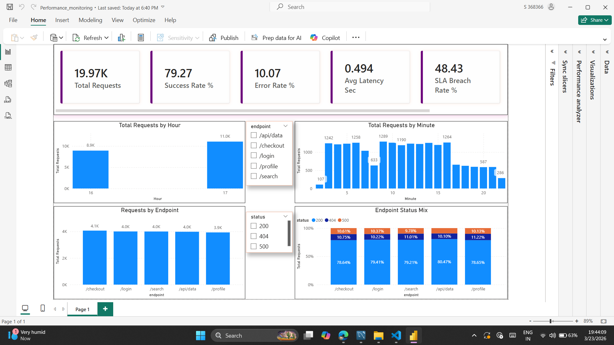

# 🚀 Database Performance Monitoring System

📌 Built to simulate real-world production monitoring systems
📌 Focus: Data quality + performance analytics + system reliability

A real-time **ETL + SQL Analytics pipeline** that simulates system logs, enforces data quality, monitors pipeline health, and generates performance insights using MySQL and Power BI.

---

# 🎯 Problem Statement

Modern applications generate massive volumes of logs, but:

* Raw logs are often **noisy, inconsistent, and unreliable**
* Poor data quality leads to **incorrect analytics and decisions**
* Performance issues remain hidden without **structured monitoring**

👉 This project solves it by building an **end-to-end data pipeline**:

**Generate → Validate → Store → Analyze → Monitor**

---

# 💡 What Makes This Project Stand Out

* Simulates real-world system behavior (latency, retries, failures)
* Implements strong data validation to prevent bad data entry
* Separates **clean vs rejected data** for reliable analytics
* Tracks pipeline health using ETL metrics
* Computes advanced KPIs (SLA breach, latency, health score)
* End-to-end pipeline from raw data → dashboard insights

---

# 🔄 System Architecture (Data Flow)

```
Log Simulator (Python)
        ↓
Raw Logs (CSV Buffer)
        ↓
ETL Validation Layer
   ↙                         ↘
Valid Data                  Rejected Data
(system_logs)              (rejected_logs)
   ↓                         ↓
Cleaned CSV                Rejected CSV
        ↘                   ↙
           ETL Metrics Tracking
                    ↓
        SQL Analytics Layer
 (Views → Basic → KPI → Advanced → Dashboard)
                    ↓
           Power BI Dashboard
```

---

# 🧩 Key Design Decisions

* Separated rejected data to avoid corrupt analytics
* Used CSV as raw layer for traceability and debugging
* Designed modular SQL scripts for scalability
* Introduced ETL metrics to monitor pipeline health
* Structured queries into layers (basic → KPI → advanced)

---

# 🧱 Core Components

## 1. Log Simulator (Python)

* Generates realistic system logs continuously
* Simulates latency, errors, retries, and edge cases

## 2. ETL Pipeline

* Validates incoming data using rules
* Separates:

  * ✅ Valid records → `system_logs`
  * ❌ Invalid records → `rejected_logs`
* Tracks pipeline stats in `etl_metrics`

## 3. SQL Analytics Layer

* Modular SQL scripts:

  * Basic metrics (totals, rates, top endpoints, hourly trends)
  * KPI calculations
  * Advanced performance analysis
* Optimized using views and structured queries

## 4. Dashboard Layer

* Power BI dashboard for:

  * System health monitoring
  * Latency trends
  * Error tracking
  * SLA compliance

### Dashboard Preview



Dashboard file location:
* `dashboard/performance_monitoring.pbix`
* `dashboard/powerbi_screenshot.png`

### Power BI Snapshot & Report

Use the provided screenshot as the default report preview and keep visuals aligned with SQL output tables.

Recommended report pages:
1. Executive KPI page: Total Requests, Success Rate, Error Rate, Avg Execution Time, SLA Breach
2. Traffic page: Requests by hour and by minute
3. Endpoint page: Top endpoints, slow endpoints, status mix
4. Diagnostics page: root cause and optimization actions from diagnostics queries

Minimum visuals checklist:
1. KPI cards: total_requests, success_rate_pct, error_rate_pct, avg_execution_time_sec, sla_breach_rate_pct
2. Trend chart: daily total requests with error and SLA breach overlays
3. Distribution chart: status code split (200/404/500)
4. Table: top slow endpoints with avg and max execution time
5. Table: endpoint-level recommended_solution from diagnostics

---

# 🗂️ Project Structure

```
SQL_PROJECT/
│
├── data/
│   ├── raw/                  # Raw generated logs
│   └── processed/            # Cleaned & rejected logs
│
├── sql/                      # Schema, analytics, automation
├── scripts/                  # Python ETL + simulator
├── dashboard/                # Power BI files
```

---

# 🧾 Database Design (Simplified)

| Table                    | Purpose                           |
| ------------------------ | --------------------------------- |
| `system_logs`            | Clean data used for analytics     |
| `rejected_logs`          | Stores invalid data for debugging |
| `etl_metrics`            | Tracks pipeline performance       |
| `alerts`                 | Stores detected anomalies         |
| `alert_threshold_config` | Defines alert rules               |
| `system_logs_archive`    | Historical storage                |

---

# ⚙️ Tech Stack

* **Python** → Data simulation & ETL
* **MySQL** → Storage & analytics
* **SQL** → KPI computation
* **Power BI** → Visualization

---

# 🛠️ Setup & Execution

## 1. Setup Database

```sql
source sql/00_schema_setup.sql;
```

---

## 2. Run Simulator

```bash
python scripts/log_simulator.py
```

This will:

* Generate logs continuously
* Validate data
* Store clean & rejected records
* Track ETL performance

---

## 3. Run Analytics

```text
1. sql/07_reset_reload.sql (optional)
2. sql/03_clean_view.sql
3. sql/01_basic_analytics.sql
4. sql/02_kpi_metrics.sql
5. sql/04_advanced_diagnostics.sql
6. sql/05_dashboard_feeds.sql
7. sql/06_diagnostics.sql
```

Run each file directly using `SOURCE` in MySQL CLI.

Procedure note:
1. `sp_archive_old_system_logs` and `sp_system_health_check` are defined in `sql/00_schema_setup.sql`.
2. `sql/06_diagnostics.sql` runs diagnostics queries and executes `CALL sp_system_health_check();`.

---

# 🧮 Query Summary

Current analytics query counts:

| SQL File | Query Count | Purpose |
| -------- | ----------- | ------- |
| `sql/01_basic_analytics.sql` | 10 | Simple checks, hourly trend, top endpoints, status distribution |
| `sql/02_kpi_metrics.sql` | 6 | KPI, ETL quality, and health score |
| `sql/04_advanced_diagnostics.sql` | 5 | Advanced analytics (latency buckets, trends, endpoint risk) |
| `sql/05_dashboard_feeds.sql` | 6 | Final dashboard feeds + slow endpoints + status + DB load |
| `sql/06_diagnostics.sql` | 14 | Root cause analysis, impact levels, fixes, and health diagnostics |

**Total analytics queries: 41**

Final object count summary:

| Basic Queries | Intermediate Queries | Advanced Queries | Stored Procedures | Triggers | Total Analytics Queries | Total Automation Objects | Grand Total |
| ------------- | -------------------- | ---------------- | ----------------- | -------- | ---------------------- | ------------------------ | ----------- |
| 10 | 12 | 19 | 2 | 0 | 41 | 2 | 43 |

Count rules used:
1. Basic queries: `sql/01_basic_analytics.sql` -> 10
2. Intermediate queries: `sql/02_kpi_metrics.sql` + `sql/05_dashboard_feeds.sql` -> 12
3. Advanced queries: `sql/04_advanced_diagnostics.sql` + `sql/06_diagnostics.sql` -> 19
4. Stored procedures: `sp_archive_old_system_logs`, `sp_system_health_check` -> 2
5. Triggers: none defined -> 0

Basic layer includes:

1. Total requests
2. Success rate
3. Error rate
4. Not-found rate
5. Average latency
6. Total error requests
7. Top endpoints by traffic
8. Top slow endpoints
9. Hourly traffic with error rate
10. Status distribution

Advanced layer includes:

1. Latency bucket distribution
2. Daily latency + error trend
3. Endpoint summary
4. Endpoint risk score
5. Peak traffic hours

Diagnostics layer includes:

1. System-level problem and fix summary
2. Endpoint-level impact and action matrix
3. Hour-level bottleneck diagnosis
4. Query complexity diagnosis (rows scanned / joins)
5. Rejection reason to action map
6. Slow query evidence
7. High-load and join-heavy evidence
8. Alert severity classification
9. Root-cause analysis with recommended fixes
10. ETL delay diagnostics and daily diagnostics trend

Procedure flow:
1. Procedure creation happens in `sql/00_schema_setup.sql`.
2. Procedure execution happens in `sql/06_diagnostics.sql`.

---

# ✅ Validation Checks (PASS/FAIL SQL)

Run these checks after data load and before dashboard refresh.

```sql
USE performance_monitoring;

-- 1) Base data exists
SELECT
  'system_logs_has_data' AS check_name,
  CASE WHEN COUNT(*) > 0 THEN 'PASS' ELSE 'FAIL' END AS status,
  COUNT(*) AS observed_value
FROM system_logs;

-- 2) View is queryable
SELECT
  'vw_system_logs_clean_has_data' AS check_name,
  CASE WHEN COUNT(*) > 0 THEN 'PASS' ELSE 'FAIL' END AS status,
  COUNT(*) AS observed_value
FROM vw_system_logs_clean;

-- 3) Status codes are valid
SELECT
  'status_codes_valid' AS check_name,
  CASE WHEN SUM(CASE WHEN status NOT IN (200, 404, 500) THEN 1 ELSE 0 END) = 0 THEN 'PASS' ELSE 'FAIL' END AS status,
  SUM(CASE WHEN status NOT IN (200, 404, 500) THEN 1 ELSE 0 END) AS invalid_rows
FROM system_logs;

-- 4) Execution time is positive
SELECT
  'execution_time_positive' AS check_name,
  CASE WHEN SUM(CASE WHEN execution_time <= 0 THEN 1 ELSE 0 END) = 0 THEN 'PASS' ELSE 'FAIL' END AS status,
  SUM(CASE WHEN execution_time <= 0 THEN 1 ELSE 0 END) AS invalid_rows
FROM system_logs;

-- 5) Endpoint is not blank
SELECT
  'endpoint_not_blank' AS check_name,
  CASE WHEN SUM(CASE WHEN endpoint IS NULL OR TRIM(endpoint) = '' THEN 1 ELSE 0 END) = 0 THEN 'PASS' ELSE 'FAIL' END AS status,
  SUM(CASE WHEN endpoint IS NULL OR TRIM(endpoint) = '' THEN 1 ELSE 0 END) AS invalid_rows
FROM system_logs;

-- 6) ETL metrics available
SELECT
  'etl_metrics_present' AS check_name,
  CASE WHEN COUNT(*) > 0 THEN 'PASS' ELSE 'FAIL' END AS status,
  COUNT(*) AS observed_value
FROM etl_metrics;

-- 7) Stored procedures exist
SELECT
  'stored_procedures_present' AS check_name,
  CASE WHEN COUNT(*) = 2 THEN 'PASS' ELSE 'FAIL' END AS status,
  COUNT(*) AS observed_value
FROM information_schema.routines
WHERE routine_schema = 'performance_monitoring'
  AND routine_type = 'PROCEDURE'
  AND routine_name IN ('sp_archive_old_system_logs', 'sp_system_health_check');

-- 8) Triggers count (expected 0)
SELECT
  'triggers_expected_zero' AS check_name,
  CASE WHEN COUNT(*) = 0 THEN 'PASS' ELSE 'FAIL' END AS status,
  COUNT(*) AS observed_value
FROM information_schema.triggers
WHERE trigger_schema = 'performance_monitoring';
```

---

# 📉 Performance Notes (From Advanced Diagnostics)

These notes are directly mapped to outputs from `sql/04_advanced_diagnostics.sql` and `sql/06_diagnostics.sql`.

| Diagnostic Output | What It Indicates | Typical Threshold | Recommended Action |
| ----------------- | ----------------- | ----------------- | ------------------ |
| Latency bucket distribution | Overall speed profile | Slow bucket share increasing | Prioritize slow endpoints first |
| Endpoint risk score | Combined risk from latency/error/SLA breach | Risk score trends up over time | Tune query plan and add endpoint-level caching |
| Alert severity classification | Request severity mix | HIGH share > 0 sustained | Immediate query and index review |
| Query-complexity diagnostics | Scan/join pressure | rows_scanned >= 5000 or joins_count >= 5 | Add selective indexes, reduce joins |
| Root-cause analysis by endpoint | Problem + cause + fix | Endpoint avg_execution_time_sec > 5 | Rewrite expensive SQL and optimize endpoint logic |
| ETL delay diagnostics | Data freshness risk | etl_delay_minutes > 60 | Check scheduler/backlog and restart ingestion job |

Use these notes as your weekly review template before publishing dashboard updates.

---

# ✅ Coverage Confirmation

The following are present in this project:

Basic:
1. Total requests
2. Avg execution time
3. Error count

Intermediate:
1. Requests by hour
2. Status distribution
3. Top endpoints

Advanced:
1. Slow queries
2. High load queries
3. Join-heavy queries

Step 6 - Alert system (monitoring logic):
1. HIGH -> execution_time > 5 sec
2. MEDIUM -> execution_time between 3 and 5 sec
3. NORMAL -> execution_time < 3 sec

Step 7 - Root cause analysis:
1. Problem
2. Cause
3. Impact level

Step 8 - Optimization engine:
1. Add index -> if rows_scanned is high
2. Reduce joins -> if joins_count is high
3. Rewrite query -> if execution_time is high

Step 9 - Power BI outputs:
Charts:
1. Requests over time
2. Status codes
3. Slow endpoints
4. DB load

KPIs:
1. Total requests
2. Avg execution time
3. Errors

---

# 📊 Key Metrics (Business Meaning)

| Metric       | Why It Matters                                              |
| ------------ | ----------------------------------------------------------- |
| Success Rate | Measures system reliability                                 |
| Error Rate   | Identifies failure frequency                                |
| Avg Latency  | Overall performance indicator                               |
| SLA Breach   | % of requests exceeding acceptable latency (e.g., >0.5 sec) |
| Health Score | Combined indicator of system reliability and performance    |

---

# 📈 Sample Output

### Simulator

```
Inserted 3 rows
Inserted 1 rows
Logs=50 Inserted=42 Rejected=8
```

### Analytics

```
total_requests: 5000
success_rate_pct: 89.40
error_rate_pct: 10.60
avg_latency_sec: 0.482
```

---

# 🚀 Business Impact

* Prevents **bad data from corrupting analytics**
* Enables **real-time system monitoring**
* Helps detect:

  * Performance bottlenecks
  * Data quality issues
  * SLA violations

👉 This mirrors real-world monitoring systems used in production environments.

---

# ⚠️ Important Notes

* Stop simulator before reset (`sql/07_reset_reload.sql`)
* CSV headers are auto-managed
* Queries are modular and reusable

---

# 🔮 Future Enhancements

* Kafka-based real-time streaming
* API ingestion layer
* Automated alerts (Email/Slack)
* Query optimization engine

---

# 👨‍💻 Author

**Karthick**
Aspiring Data Analyst / Data Engineer

---

# ⭐ Final Takeaway

This project demonstrates a **complete data pipeline**, not just SQL queries.

👉 It covers:

* Data generation
* Data cleaning
* Data storage
* Data analysis
* Performance monitoring

🔥 This project shows how raw data becomes actionable insights through a structured pipeline.
